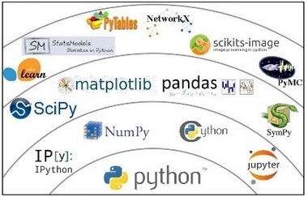
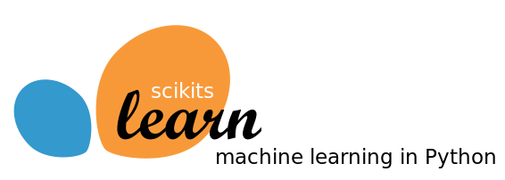
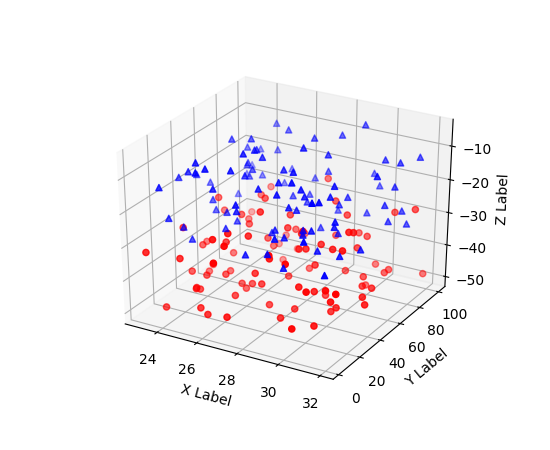
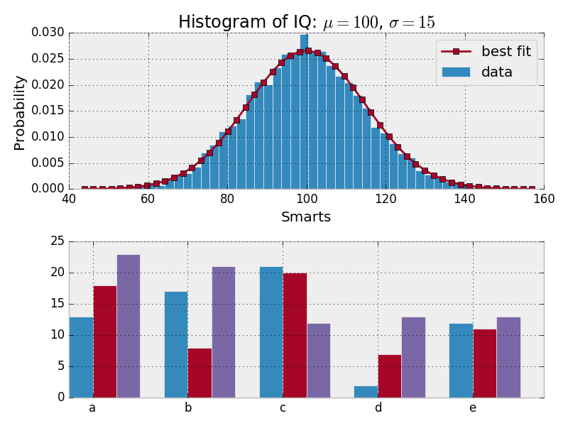

## Introducción a Python para Inteligencia de Negocio

--- 

## ¿Por qué Python?

Python es un lenguaje muy usado en *Análisis de Datos* e *Inteligencia de Negocio*.  

- Lenguaje fácil de aprender. 

- Muy alto nivel (manejo de datos).

- Buenas herramientas de visualización.

- Librerías fáciles de **Machine Learning**. 

- Fácil de integrar con otras librerías/entornos.

---

# Lenguaje fácil de aprender

## Se diseñó para ser sencillo

+++

## Hello World

```
print("Hello, World")
```

- No requiere ";" tras cada sentencia. 

- No requiere definir clase o main, sólo código.

+++ 

## tabulación, no llaves 

```
sumcars = 0
sumwords = 0

for word in ['hola', 'a', 'todos']:
    print("Frase: ", word)
    sumcars += len(word)
    sumwords += 1
    
print("Se han mostrado ", sumwords, " palabras y ", sumcars, " caracteres")
```

@[1-4,9](código al primer nivel)
@[4-7](Identifica el cuerpo del for/if por la tabulación)
@[1-9]()

+++

## Variables

```
a = 3
msg = "hola"
a = 7
b = 2
c = a / b # Da 3.5, no 3
d = a // b # Da 3, división entera.
```

- No se define el tipo de una variable. 

- Una variable puede tener distintos tipos.

- La división por defecto es exacta.

+++

## Condiciones

```
if a < 0:
   print("a must be positive")
elif a > 10:
   print("a is too large")
else: 
   print("Perfect!")
```

@[1-2]
@[1-2,5-6]
@[1-4]


## Formato

- Las condiciones terminan en ":".
- *elif* implica *else if*. 
- La tabulación indica el cuerpo.

+++

## Bucles for

- No sigue el formato *for* de C/C++.
- *for* recibe una lista/iterador.

+++ 

## Bucles for

```
a = range(10)

for i in range(len(a)): 
    print("Iteration ", i)
```
#### Estilo C/C++

```
a = range(10)

for val in a:
    print(val)
```
#### Estilo **pythonico**
+++

## Bucles for

¿Y para dos vectores?

```
articulos = ['zapatos', 'camisa', 'abrigo']
precios = [50, 15, 70]

for i in range(len(articulos)):
    print("Precio de ", articulos[i], " = ", precios[i])

```

+++

## Bucles for

```
articulos = ['zapatos', 'camisa', 'abrigo']
precios = [50, 15, 70]

for art, price in zip(articulos, precios):
    print("Precio de ", art, " = ", price)

```

En formato *pythonico* (zip combina dos listas). 


+++

## Listas

```
a = [1, 2, 3]
len(a) # Devuelve 3

for x in a:
    print(x)
```

+++

### Diccionarios

```
msg = {'es': 'Hola', 'en': 'Hello'}

print(msg["es"])

for lang in msg:
    print("Idioma: '", lang,  "'", sep='')
    
print("Idiomas", msg.keys())

for lang in msg:
    print("Language[", lang, "]: ", msg[lang], sep='')

```
@[1-3]
@[5-8]
@[10-11]

- Soporte nativo de tablas hash/diccionarios. 
- Se itera por las claves.

+++

## Funciones

```
def mysqrt(value):
    return value**2
```

- Se define con *def*.
- La tabulación limita el cuerpo. 
- Uso de return.

+++ 

## Módulos

- Python usa módulos. 

- Hay que hacer un **import** de las librerías que se van a usar.

- Se usa indicando *nombre_paquete.nombre_funcion*.

```
import numpy

a  = numpy.ones(100)
```

+++

## Módulos

- Por comodidad se puede acordar.

```
import numpy as np

a = np.ones(100)
```

---

# Uso científico



+++

## Librerías científicas




---

## Numpy

- Permite trabajar con vectores de reales. 

```
>>> import numpy as np
>>> a = np.arange(15).reshape(3, 5)
>>> a
array([[ 0,  1,  2,  3,  4],
       [ 5,  6,  7,  8,  9],
       [10, 11, 12, 13, 14]])
>>> a.shape
(3, 5)
>>> a.ndim
2
```

+++

## Numpy:  Expresiones

```
>>> a = np.array( [20,30,40,50] )
>>> b = np.arange( 4 )
>>> b
array([0, 1, 2, 3])
>>> c = a-b
>>> c
array([20, 29, 38, 47])
>>> b**2
array([0, 1, 4, 9])
>>> 10*np.sin(a)
array([ 9.12945251, -9.88031624,  7.4511316 , -2.62374854])
>>> a<35
array([ True, True, False, False], dtype=bool)
```

--- 

## Visualización de datos




